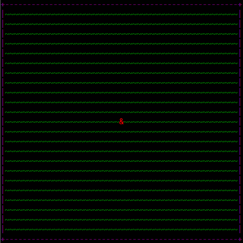
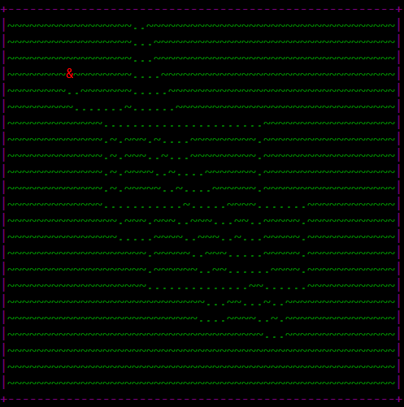

# Symbol Game

🕹️ **Symbol Game** is a simple console game written in C++ where the player controls a character exploring a map made up of symbols.

## 🚀 Features:
- Move around the map using `WASD` keys.
- A map with a border.
- Colorful interface with different colors for map elements and character, enhancing the visual experience. with different colors for map elements and character, enhancing the visual experience.
- Grass flattening mechanic when stepping on grass tiles. 

- Aaaand that's all for now.